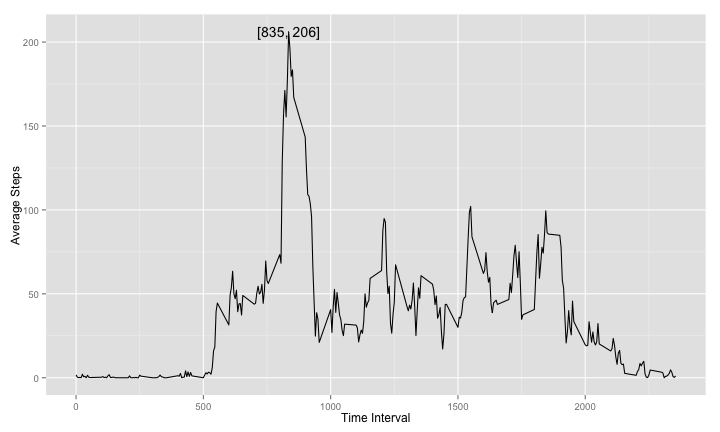

# Reproducible Research: Peer Assessment 1


## Loading and preprocessing the data
Load activity data into data frame and remove NA data
Change factor date to date format

```r
unzip("activity.zip")
activity <- read.csv("activity.csv")
activity$date <- as.Date(activity$date)
summary(activity) 
```

```
##      steps            date               interval   
##  Min.   :  0.0   Min.   :2012-10-01   Min.   :   0  
##  1st Qu.:  0.0   1st Qu.:2012-10-16   1st Qu.: 589  
##  Median :  0.0   Median :2012-10-31   Median :1178  
##  Mean   : 37.4   Mean   :2012-10-31   Mean   :1178  
##  3rd Qu.: 12.0   3rd Qu.:2012-11-15   3rd Qu.:1766  
##  Max.   :806.0   Max.   :2012-11-30   Max.   :2355  
##  NA's   :2304
```

```r
head(activity)
```

```
##   steps       date interval
## 1    NA 2012-10-01        0
## 2    NA 2012-10-01        5
## 3    NA 2012-10-01       10
## 4    NA 2012-10-01       15
## 5    NA 2012-10-01       20
## 6    NA 2012-10-01       25
```

## What is mean total number of steps taken per day?  
We have 0 step data and NA step data. To get exact data, I remove NA steps.  
Median of steps taken per day

```r
library(plyr)
na.removed <- subset(activity, is.na(steps) == FALSE)
dayGrouped <- ddply(na.removed, .(date), summarise, 
                    day.sum = sum(steps, na.rm = TRUE))  
median(dayGrouped$day.sum)
```

```
## [1] 10765
```
Mean of steps taken per day

```r
mean(dayGrouped$day.sum)
```

```
## [1] 10766
```
  
Let's make a histogram.

```r
library(ggplot2)
breaks <- pretty(range(dayGrouped$day.sum), 
                 n = nclass.FD(dayGrouped$day.sum), min.n=1)
binwidth <- breaks[2] - breaks[1]
ggplot(dayGrouped, aes(x=day.sum)) + 
    geom_histogram(binwidth = binwidth, col = "white", 
                   fill = "black", alpha = 0.5) +
    geom_vline(xintercept = median(dayGrouped$day.sum), col = "red" ) +
    xlab("Steps") + ylab("Number of Days")
```

 

## What is the average daily activity pattern?

```r
daily <- ddply(activity, .(interval),  summarise, step.mean = mean(steps, na.rm = TRUE))
maxSteps <- max(daily$step.mean)
maxInterval <- daily[which.max(daily$step.mean), c("interval")]
position <- paste("[", as.integer(maxInterval), ", ", as.integer(maxSteps), "]", sep="")
ggplot(daily, aes(interval, step.mean)) + geom_line() +
    annotate("text", x = maxInterval, y = maxSteps, label = position) +
    xlab("Time Interval") + ylab("Average Steps")
```

 


## Imputing missing values  
There are many NA rows.

```r
nrow(activity[is.na(activity$steps), ])
```

```
## [1] 2304
```


## Are there differences in activity patterns between weekdays and weekends?
