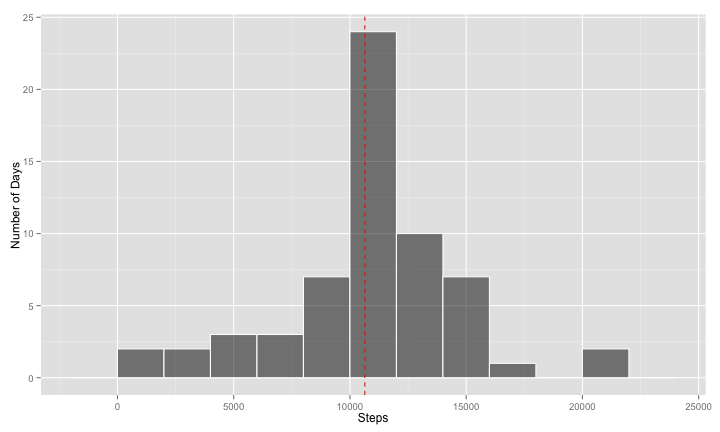

# Reproducible Research: Peer Assessment 1


## Loading and preprocessing the data
Load activity data into data frame. There are many NA values. 
Change factor date values to date format

```r
unzip("activity.zip")
activity <- read.csv("activity.csv")
activity$date <- as.Date(activity$date)
head(activity)
```

```
  steps       date interval
1    NA 2012-10-01        0
2    NA 2012-10-01        5
3    NA 2012-10-01       10
4    NA 2012-10-01       15
5    NA 2012-10-01       20
6    NA 2012-10-01       25
```

## What is mean total number of steps taken per day?  
We have 0 step data and also NA step data. To get exact data, I remove NA steps.  
Median of steps taken per day

```r
library(plyr)
na.removed <- subset(activity, is.na(steps) == FALSE)
dayGrouped <- ddply(na.removed, .(date), summarise, day.sum = sum(steps, na.rm = TRUE))
median(dayGrouped$day.sum)
```

```
[1] 10765
```
Mean of steps taken per day

```r
mean(dayGrouped$day.sum)
```

```
[1] 10766
```
  
Let's make a histogram.

```r
library(ggplot2)
breaks <- pretty(range(dayGrouped$day.sum), n = nclass.FD(dayGrouped$day.sum), 
    min.n = 1)
binwidth <- breaks[2] - breaks[1]
ggplot(dayGrouped, aes(x = day.sum)) + geom_histogram(binwidth = binwidth, col = "white", 
    fill = "black", alpha = 0.5) + geom_vline(xintercept = median(dayGrouped$day.sum), 
    col = "red", linetype = "dashed") + xlab("Steps") + ylab("Number of Days")
```


## What is the average daily activity pattern?

```r
daily <- ddply(activity, .(interval), summarise, step.mean = mean(steps, na.rm = TRUE))
maxSteps <- max(daily$step.mean)
maxInterval <- daily[which.max(daily$step.mean), c("interval")]
position <- paste("[", as.integer(maxInterval), ", ", as.integer(maxSteps), 
    "]", sep = "")
ggplot(daily, aes(interval, step.mean)) + geom_line() + annotate("text", x = maxInterval, 
    y = maxSteps, label = position) + xlab("Time Interval") + ylab("Average Steps")
```


```r
print(maxSteps)
```

```
[1] 206.2
```


## Imputing missing values  
There are many NA rows.

```r
nrow(activity[is.na(activity$steps), ])
```

```
[1] 2304
```
I use 5-minute interval for filling NA values. After filling NA values, median 
and mean values are lower than first try.

```r
replaceNA <- function(p_steps, p_interval) {
    newStep <- p_steps
    if (is.na(p_steps) == TRUE) {
        newStep <- as.integer(daily$step.mean[which(daily$interval == p_interval)])
    }
    newStep
}
activity.new <- ddply(activity, .(steps, date, interval), transform, steps = replaceNA(steps, 
    interval))
dayGrouped.new <- ddply(activity.new, .(date), summarise, day.sum = sum(steps))
median(dayGrouped.new$day.sum)
```

```
[1] 10641
```

```r
mean(dayGrouped.new$day.sum)
```

```
[1] 10750
```
Here's new histogram with non NA values.

```r
breaks.new <- pretty(range(dayGrouped$day.sum), n = nclass.FD(dayGrouped$day.sum), 
    min.n = 1)
binwidth.new <- breaks.new[2] - breaks.new[1]
ggplot(dayGrouped.new, aes(x = day.sum)) + geom_histogram(binwidth = binwidth.new, 
    col = "white", fill = "black", alpha = 0.5) + geom_vline(xintercept = median(dayGrouped.new$day.sum), 
    col = "red", linetype = "dashed") + xlab("Steps") + ylab("Number of Days")
```




## Are there differences in activity patterns between weekdays and weekends?
There are differences between two patterns. In weekdays, 5am to 9am is the most
active time. Maybe the person who wear this device go to work by foot or riding
bycycle.

```r
activity.new$week <- ifelse(weekdays(activity.new$date) == "Sunday" | weekdays(activity.new$date) == 
    "Saturday", "weekend", "weekday")
activity.new$week <- as.factor(activity.new$week)
daily.new <- ddply(activity.new, .(interval, week), summarise, step.mean = mean(steps))
ggplot(daily.new, aes(x = interval, y = step.mean)) + geom_line() + facet_grid(. ~ 
    week) + xlab("Time Interval") + ylab("Average Steps")
```


